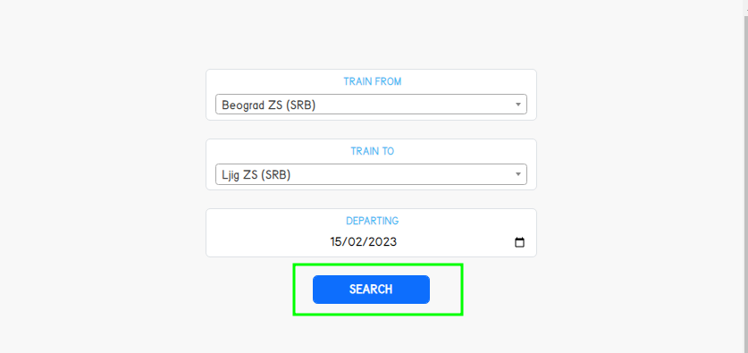

## Documentation 

RailwayTrips is single page mini-project which displays available train trips.

It consists of three fields - starting station, final station with a list of stations and departure date.

The fields are validated ( on front and backend ) and marked if :
- if one of the fields is not selected
- if starting station and final station are same
- if departure date is in the past

Currently available main trips with their routes are :

1. Beograd ZS (SRB) - Cacak ZS (SRB) => [ Beograd ZS (SRB) - Lazarevac ZS(SRB) - Ljig ZS (SRB) - Cacak ZS (SRB)  ]
2. Novi Sad ZS (SRB) - Sarajevo ZS (BIH) => [ Novi Sad ZS (SRB) - Banjaluka ŽS (BIH) - Sarajevo ZS (BIH) ]
3. Beograd (SRB) - Ljig ZS (SRB) => [ Beograd ZS (SRB) - Lazarevac ZS(SRB) - Ljig ZS (SRB) ]

There are two carriers : SNCF, Eurostar.

The user will be shown the trips between each station on the same route.

After filling in the fields, the user will receive a trip list with the following information : 

There is a details button that shows route and their times.

If the trip between stations does not exist, it will print a message.

